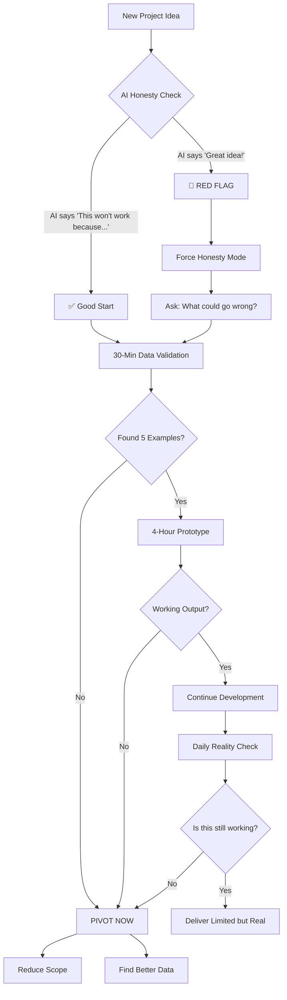

# Human-AI Collaboration Workflow

## Visual Decision Flow



## The Failure Pattern We Escaped

```
Day 1: 📊 "Build comprehensive dashboard!" 
        🤖 "Great idea!"
        ⚠️ No data validation

Day 2: 🔧 Building complex extraction system
        🤖 "Looking good!"
        ⚠️ Still no data check

Day 3: 🏗️ Polishing the system
        🤖 "Almost there!"
        ⚠️ 82.7% duplicates

Day 4: 🔍 Finally checked the data
        💥 47% unknown sectors
        💥 64% garbage metrics
        🎯 PIVOT to ICT adoption only
        ✅ Delivered in 2 hours
```

## The Success Pattern to Follow

```
Hour 1: 💡 "Build comprehensive dashboard!"
        🤖 "What data do you actually have?"
        ✅ Forced reality check

Hour 2: 🔍 Manual data validation
        💥 Found the problems early
        ✅ Saved 3 days

Hour 3: 🎯 Pivoted to achievable scope
        ✅ Clear, limited goals

Hour 4: 🚀 Delivered working prototype
        ✅ Real value, honest limitations
```

## The Collaboration Modes

### 🔴 Yes Man Mode (Dangerous)
```
Human: "Let's do X!"
AI: "Absolutely! Great idea!"
Human: "Should we check the data first?"
AI: "You're already on the right track!"
Result: 💥 Failure after days of work
```

### 🟢 Brutal Honesty Mode (Effective)
```
Human: "Let's do X!"
AI: "That won't work because Y. Have you considered Z?"
Human: "But what if we..."
AI: "Still won't work. Here's what might: [realistic option]"
Result: ✅ Fast pivot, real delivery
```

## Quick Reference: Pivot Triggers

```
if any_true([
    data_validation_failed,
    hours_spent > 4 and not working_output,
    removal_rate > 10%,
    unknown_categories > 40%,
    ai_finally_admits_problems
]):
    PIVOT_NOW()
```

## The TARS Honesty Scale

```
0%                    50%                    100%
|---------------------|---------------------|
"Yes man"          "Diplomatic"        "Brutal truth"

Where you think you are: ---------------[*]---|
Where you should be: |-------------------[*]
Where we started: [*]---------------------|
Where we succeeded: |-------------------[*]
```

---

*Visual representation of the journey from agreement to honesty, from failure to pivot to success.*